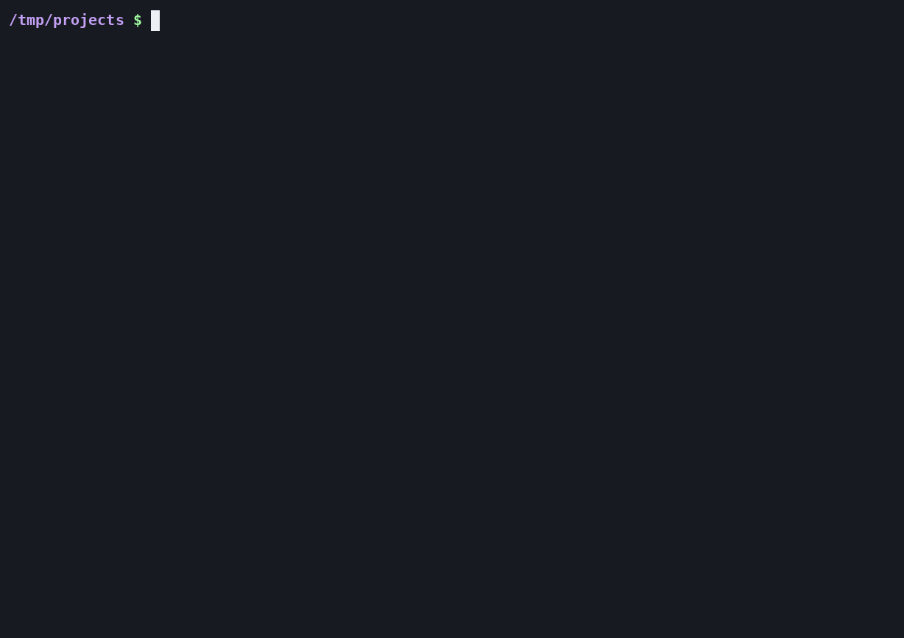
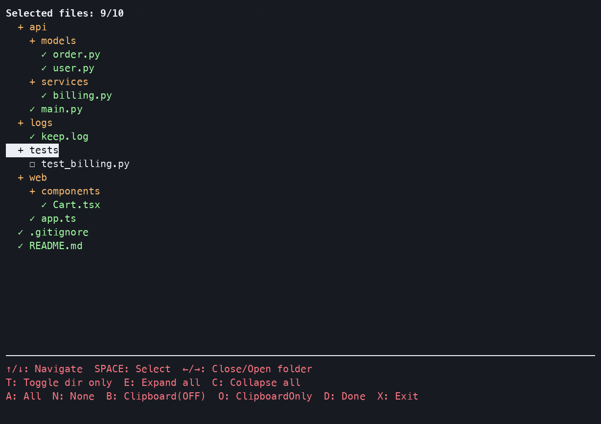
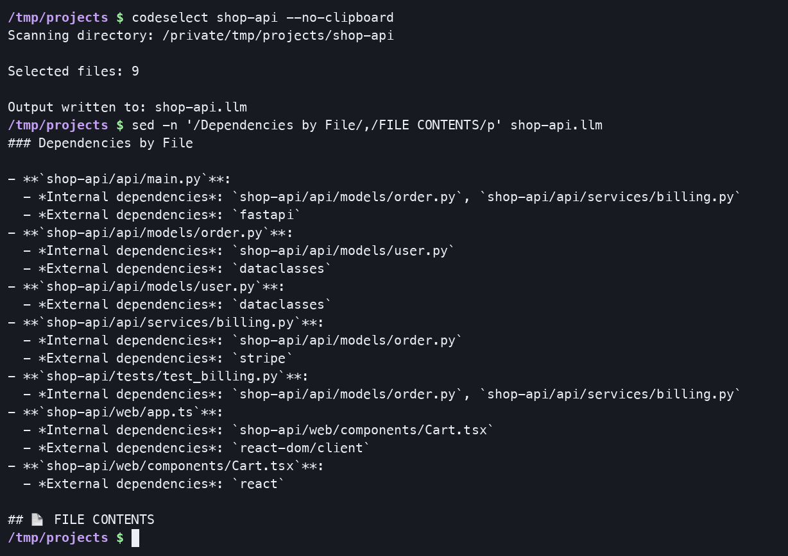

# CodeSelect

[](LICENSE)


Pick files from a project in a terminal UI and export them as a single document for an LLM: the project tree, a map of which files import which, and the selected sources.



## Why

I built CodeSelect in February 2025, before agentic coding harnesses such as Claude Code and Codex became part of my workflow. At the time, most of my LLM work happened in chat windows, and giving a model the right context meant pasting files one by one and describing the layout by hand. A model reasons about code far better when it sees the right files and how they relate, so CodeSelect makes that one step: tick the relevant files and get one document with the tree, the import relationships and the code.

Coding agents now read repositories themselves. CodeSelect remains useful with plain chat interfaces, or whenever you want to control exactly what the model sees.

## Install

```bash
curl -sSL https://raw.githubusercontent.com/maynetee/codeselect/main/install.sh | bash
```

The script copies `codeselect.py` to `~/.local/bin/codeselect` (no admin rights), adds that directory to your `PATH` in your shell config if needed, and installs bash completion when your login shell is bash. CodeSelect is one file using only the Python standard library, so `python3 codeselect.py` from a clone works too.

Requirements: Python 3.9+ with `curses` (bundled on macOS and Linux; native Windows needs the `windows-curses` package), plus a system clipboard tool (see [Clipboard](#clipboard)).

Uninstall with `curl -sSL https://raw.githubusercontent.com/maynetee/codeselect/main/uninstall.sh | bash`. It also removes the `export PATH="$HOME/.local/bin:$PATH"` line from your shell config, keeping a `.bak` copy.

## Screenshots

| Pick what the model sees | Get the import map with the code |
|---|---|
|  |  |

In this demo project, `.gitignore` excludes `node_modules/` and `*.log` but re-includes `logs/keep.log`, and `react-dom/client` is reported as an external dependency.

## Usage

```bash
codeselect                                  # pick files in the current directory
codeselect ~/projects/api --format md -o api-context.md
codeselect --skip-selection --no-clipboard  # no UI: every file, written to disk only
codeselect --clipboard-only                 # no UI: every file, clipboard only
```

| Option | Effect |
|---|---|
| `directory` | Directory to scan (default: current directory) |
| `-o`, `--output PATH` | Output file. Default: `<dirname>.<format>` in the current directory, e.g. `api.llm`, then `api(1).llm` if taken |
| `--format {llm,md,txt}` | Output format (default: `llm`) |
| `--skip-selection` | Skip the UI and include every non-ignored file |
| `--no-clipboard` | Do not copy the output (in the UI, it sets the starting state of the `B` toggle) |
| `--clipboard-only` | Skip the UI, copy every non-ignored file to the clipboard, write no file |
| `--version` | Print the version |

### Controls

All files start selected. Ignored files never appear in the tree.

| Key | Action |
|---|---|
| `↑` / `↓` | Move |
| `→` / `←` | Expand / collapse a directory (`←` on a file jumps to its parent) |
| `Space` | Toggle a file, or a directory and everything under it |
| `T` | Toggle only the direct children of the current directory |
| `A` / `N` | Select all / none |
| `E` / `C` | Expand all / collapse all |
| `B` | Toggle clipboard copy (on by default) |
| `O` | Copy to the clipboard without writing a file, then exit |
| `D` / `Enter` | Write the output file (and copy it if `B` is on) |
| `X` / `Esc` | Quit without writing anything |

### Output formats

| Format | Content |
|---|---|
| `llm` (default) | Project summary, tree, file relationships, then each selected file with its dependencies and code |
| `md` | Title, tree, then each selected file under its own heading, in a code fence tagged with its extension |
| `txt` | Tree inside `<file_map>` tags, then files inside `<file_contents>` as `File: <path>` followed by the code |

### Clipboard

| Platform | Tool |
|---|---|
| macOS | `pbcopy` |
| Linux, Wayland | `wl-copy` (package `wl-clipboard`) |
| Linux, X11 | `xclip`, falling back to `xsel` |
| WSL | `clip.exe` |
| Windows | `clip` |

If the copy fails, the output is saved to `~/codeselect_output.txt` instead.

## How it works

1. **Scan.** Walk the directory, skipping symlinks, a built-in list (`.git`, `__pycache__`, `*.pyc`, `.DS_Store`, `.idea`, `.vscode`), and patterns from the project's root `.gitignore`, an optional `.projectignore`, and global ignore files (`~/.gitignore_global`, `~/.config/git/ignore`, `~/.gitignore`).
2. **Select** files in the curses UI.
3. **Analyze** (`llm` format only). Every file in the tree, selected or not, is read as UTF-8 (binary files are skipped) and scanned with per-language regular expressions for import statements: Python, C/C++ (`#include`), JavaScript/TypeScript (`import`, `require`), Java, Kotlin, Go, Ruby, PHP, Rust (`use`, `mod`, `extern crate`), Swift, Dart, shell (`source`) and Makefiles (`include`). Each import is then matched against the project's files by name, extensionless name and path suffix, trying variants such as dots to slashes, common extensions, `index.js`/`index.ts` and `__init__.py`. A match becomes an internal dependency; anything else is kept as an external name.
4. **Write** the file and/or copy to the clipboard.

Because the analysis covers the whole tree, the relationships section also describes files you did not paste, which gives the model a map of the project beyond the included code. Files imported by two or more others are listed as core files. An abridged `llm` output for a four-file Python project:

````markdown
# PROJECT ANALYSIS FOR AI ASSISTANT

## 📦 GENERAL INFORMATION

- **Project path**: `/home/you/demo`
- **Total files**: 4
- **Files included in this analysis**: 4
- **Main languages used**:
  - Python (4 files)

## 🗂️ PROJECT STRUCTURE

```
/home/you/demo
    ├── app
    │   ├── __init__.py
    │   ├── models.py
    │   └── service.py
    └── main.py
```

## 🔄 FILE RELATIONSHIPS

### Core Files (most referenced)

- **`demo/app/models.py`** is imported by 2 files

### Dependencies by File

- **`demo/app/service.py`**:
  - *Internal dependencies*: `demo/app/models.py`
  - *External dependencies*: `requests`

## 📄 FILE CONTENTS

### demo/app/service.py

**Dependencies:**
- Internal: `demo/app/models.py`
- External: `requests`

```py
import requests
import app.models
```
````

## Project layout

| Path | Role |
|---|---|
| `codeselect.py` | The whole tool, in sections: ignore rules (`read_gitignore`, `matches_gitignore_pattern`), tree model (`Node`, `build_file_tree`, `flatten_tree`), dependency analysis (`analyze_dependencies`), output writers (`write_llm_optimized_output`, `write_markdown_output`, `write_output_file`), clipboard (`find_best_clipboard_tool`, `optimized_copy_to_clipboard`), terminal UI (`FileSelector`) and CLI (`main`) |
| `install.sh` / `uninstall.sh` | User-level install and removal (`~/.local/bin`, `PATH`, bash completion) |

## Limitations

- **Imports are found with regular expressions, not parsers.** Matches inside comments or strings count, and Kotlin `package` and PHP `namespace` lines are recorded as dependencies.
- **Resolution is name-based.** Files sharing a name (`index.js`, `__init__.py`, `utils.py`) can be confused. A dependency is internal only when it resolves to one of the analysed files; everything else is listed as external.
- **Ignore handling follows git for the common cases** (last matching pattern wins, `!` re-includes, trailing `/` matches directories only, leading `/` anchors to the root), but only the root `.gitignore` is read, not nested ones. As in git, a file inside an ignored directory cannot be re-included.
- **No size control.** There is no token count or file-size limit, and the `llm` analysis reads every file in the tree, which can be slow on large repositories.
- The output contains the absolute project path, and the default output file is written to the current directory, so a later run from the project root will list it unless it is ignored.

## Tests

Standard library only, like the tool itself:

```bash
python3 -m unittest discover tests
```

They cover the `.gitignore` semantics and the dependency analysis.

## Contributing

Issues and pull requests are welcome. Thanks to [@jalanb](https://github.com/jalanb) (J Alan Brogan) for the first `.gitignore` support.

## License

[GPL-3.0](LICENSE)
